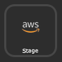
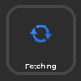
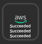

# Stream Deck - AWS CodePipeline
Stream Deck Plugin - With this plugin, you can simply click a button to get the AWS CodePipeline status.

## Button Status
Status | Screenchot
---|---
Default | 
Fetching | 
Result | 

---

## Supported Stage
- [x] Source
- [x] Build
- [ ] Test
- [x] Deploy
- [ ] Approval
- [ ] Invoke

## Install
[Download Plugin](./dist/tw.phantas.aws-codepipeline-status.streamDeckPlugin) in dist folder and click to install.

## Feature
- Get CodePipeline stage's state.
- Select specific stage or display all stage.
- Long Press to open aws codepipeline webpage.

## Setting up
Config | Description
---|---
Pipeline | uuid of code pipeline
Access Key Id | AWS IAM access key
Secret Access Key | AWS IAM secret access key
Region | AWS Region id. `ap-northeast-1`

